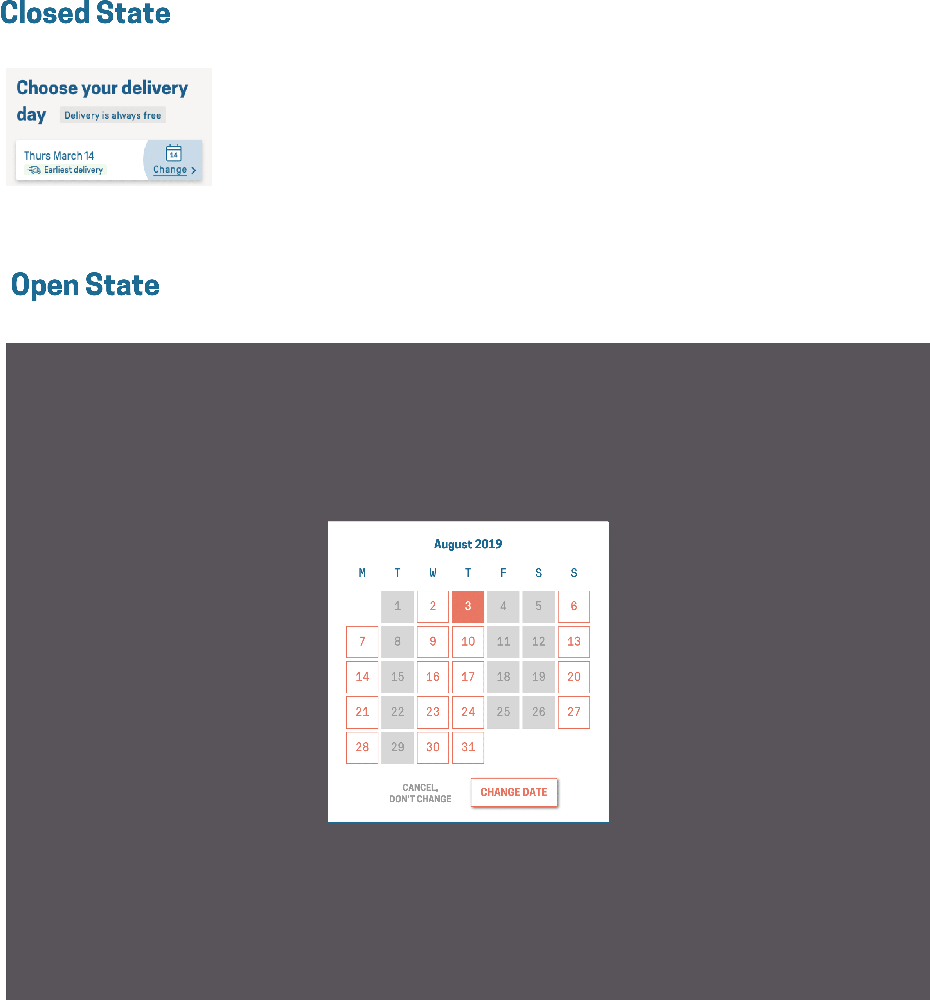

# Butternut Box Engineering Tasks

This repository hosts documentation and starter code for the coding tasks we use in the Engineering team interview process at Butternut Box. These tasks are designed to resemble features we would build as part of our day-to-day, so that you can get a sense of what it's like here.

Start by reading the appropriate prompt below. Then, you can clone the folder which includes some boilerplate code to help you get started with your task. Feel free to edit as much as you want, use the tools that are set up (or not) or even start from scratch if you prefer. We'd love to hear any questions or comments you might have in the process.

### [View the Calendar Task (for Front-End candidates)](#calendar-task)

### [View the Phone Number Task (for Full-Stack candidates)](#phone-number-task)

## Calendar Task

### Introduction

During our signup process, it's important to us that customers are able to select their preferred delivery date so they see how flexible the service we offer is. This step is done on our checkout, and is composed of a pre-selected date (Which is the earliest available delivery), and a prompt to allow them change it. Clicking on this prompt opens up a modal that allows them select a new date for delivery. We'd like you replicate some of this functionality for us.

### Task

We’d love for you to create a simple calendar view outlined in the PDF attached below in React and CSS, similar to the approach we take on checkout. As we've outlined in the image below, the initial state should be a button that opens a modal with a background overlay greying out the background. Once clicked, a modal should animate in, and I should then be able to adjust my delivery date to another 'deliverable' date. Clicking on the 'change date' button, 'cancel, don't change' button, or the background, should close the modal after saving the user option if appropriate.

The dates listed should the current month. You should correctly dynamically handle the start date and end date of the month being any day of the week.

Some notes:

1. We’re keen to ensure that it’s a collaborative effort - feel free to check in regularly to
discuss any aspect of the project.
2. The modal should only be rendered on the page (added to the DOM) when open. We don't want extra HTML nodes hanging around on the page when it's closed. Think about how this might impact the animation of the item.
3. Further animation beyond the opening and closing of the modal and any other ideas you have to improve the user experience and show off your attention to detail would be a great bonus!
4. You can only select one date at a time in the calendar.
5. You are free to use animation libraries, within reason.
6. The date in the calendar icon in the closed state should be dynamic and reflect the selected date.

### UI Design

### Tooling

We've set up a basic Create React App (see each project's README for more details). We've also set up TypeScript and Sass as tools that you can use,
but feel free to adjust if you prefer a different setup.

### Other notes

- We've included some assets that you'll need such as SVGs, fonts, and our colours. We're interested in seeing how you organise the project's folder
structure so we've left that up to you.

- Comments and documentation are always appreciated as part of the submission.

## Phone Number Task

TODO